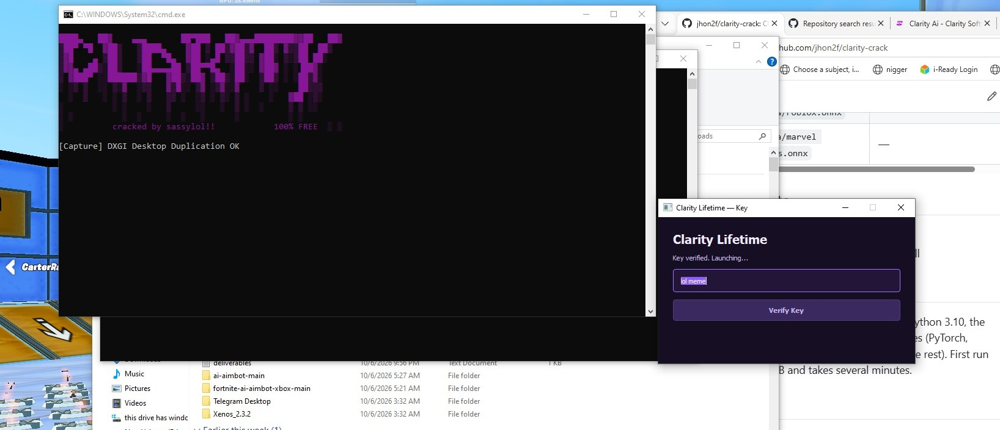
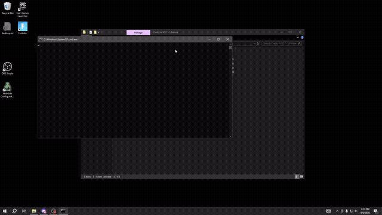

  

# Clarity Makcu V2.8

Hardwareless AI aimbot for Windows. The license check has been removed — no key, no account, no MAKCU board. It just runs.

---

## What it is

Clarity Makcu is a neural-network aimbot. It runs the target-detection model locally
through onnxruntime (DirectML), captures the screen with bettercam, and moves the mouse
toward detected players. The "Makcu" name comes from an optional USB board for 2-PC /
undetectable setups, but this build works fully **hardwareless** — software-only.

The original program validates a license key against two remote servers (PlatoBoost +
KeyAuth) before it will start. In this build both checks point at a local mock server
that always says "valid", so you can type anything into the key box.

## Tutorial

Full walkthrough (with audio): [clarity_hardwareless_tutorial.mp4](clarity_hardwareless_tutorial.mp4) — download and play, or open it in the GitHub file viewer.

## Features

- AI aimbot with head/neck/body targeting, smoothing, custom FOV
- Triggerbot and anti-recoil
- Visuals: FOV circle, crosshair, target boxes, target tracers
- Neural preview overlay (live detection view)
- Stream-proof mode
- Multiple input backends: SendInput, GamePadEmu, serial proxy, RP2040 HID, MAKCU 1-PC / 2-PC, DS4
- Config presets per game

## Supported games

| Game | Model | Config |
| --- | --- | --- |
| CS2 | `extra/cs2.onnx` | `extra/configs/config.json` |
| Fortnite | `extra/fortnite.onnx` / `fortnite-best.onnx` | `extra/configs/insane fortnite.json` |
| Blood Strike | `extra/universal.onnx` | `extra/configs/bloodstrike.json` |
| Roblox | `extra/roblox.onnx` | — |
| Marvel Rivals | `extra/marvel rivals.onnx` | — |

## Requirements

- Windows 10 or 11 (64-bit)
- Internet for the one-time dependency install

## Install

Run `installs.bat` as administrator. It sets up Python 3.10, the Visual C++ runtime,
and all Python dependencies (PyTorch, onnxruntime-directml, PyQt5, bettercam, and the
rest). First run downloads a few GB and takes several minutes.

## Run

1. Double-click `crack.bat` and accept the UAC prompt.
2. Loader window: leave the hardware boxes unchecked, click **Start**.
3. Key window: type anything, click **Verify Key**. It accepts.
4. Main window: **Load Config** → pick your game, launch the game, hold the aim hotkey.

The tutorial video in this repo (`clarity_hardwareless_tutorial.mp4`) walks through the
whole thing if you prefer to watch.

## Important: GamePadEmu vs SendInput

The input method defaults to **SendInput** even if you pick **GamePadEmu** in the loader,
and the bundled configs revert to SendInput when loaded. If you play on controller (or
your aim stops working after loading a config), open **Misc** and set the input method
back to **GamePadEmu**.

## Controller setup

Aim only engages while the Aim Hotkey is held. A controller can't press a keyboard key
on its own, so map one with [AntiMicroX](https://github.com/AntiMicroX/antimicrox/releases):

1. Open AntiMicroX with the controller plugged in.
2. Bind a keyboard key (e.g. `K`) to a spare button or trigger.
3. In the aimbot: **AI AIMBOT → AIMBOT → Aim Hotkey** → press `K`.
4. Holding that button now holds the aim hotkey.

Keep AntiMicroX running while you play.

## Quick test

Tick **Neural Preview** and point the screen at a person or a player image. Detection
boxes should draw around the body. That confirms model, capture, and GPU are all working
before you open a game.

## Troubleshooting

| Problem | Fix |
| --- | --- |
| `Python 3.10 not found` | Run `installs.bat` first |
| Aim not tracking | **Misc → input method → GamePadEmu** |
| `onnxruntime` import error | Re-run `installs.bat` (fixes the gpu/directml conflict) |
| No capture | Run the game borderless/fullscreen, not exclusive fullscreen |

## How the crack works

The compiled module (`extra/main.cp310-win_amd64.pyd`) had its two license-server URLs
rewritten to `127.0.0.1:8443`. `extra/crack_server.py` is a small HTTP server that
answers those requests with a forged "valid" response, including the correct signature
hash. The app never reaches the real servers.

## Support

Need help or updates?

- Telegram: [t.me/leakitall](https://t.me/leakitall)
- Discord: `sassymemelol`

## Disclaimer

This is a game cheat. Using it in any online game risks a ban and may violate the game's
terms of service. Use on accounts and machines you don't care about losing.
